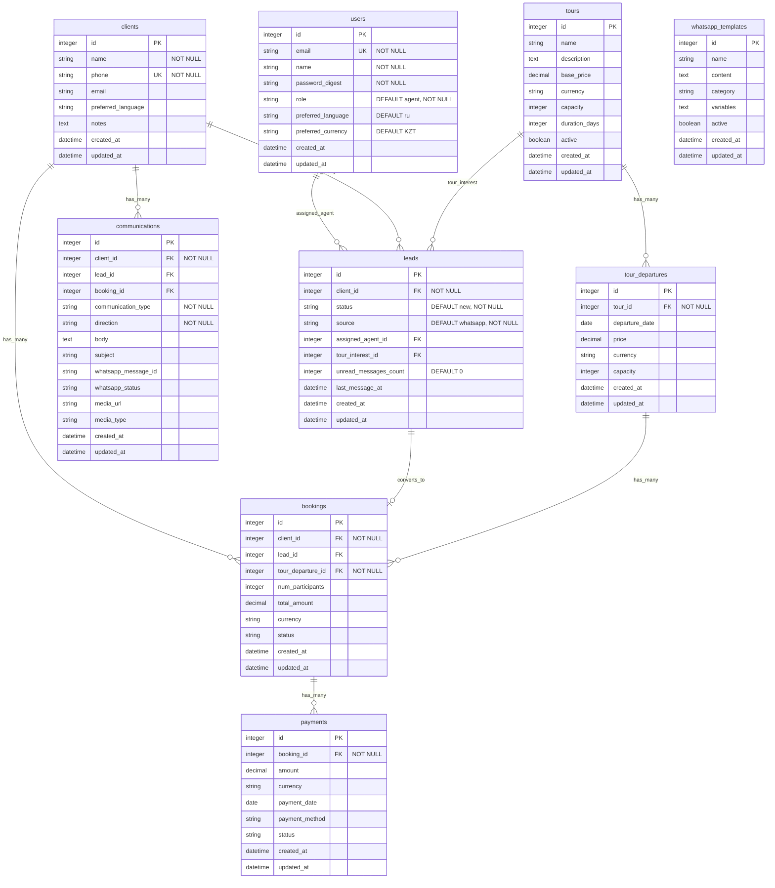

# Database ERD - Dreamland PRO

## Architecture Overview

### Key Design Principles

This data model follows a **Client-Centric Architecture** that separates the concepts of:
- **Client** = A person (lifetime relationship, identified by phone number)
- **Lead** = A sales opportunity (specific inquiry, moves through pipeline)
- **Booking** = A confirmed purchase (tour reservation)

### Why This Matters

**Previous Architecture Issue:**
- Lead had unique phone number → Customer could only inquire once ever
- Lead-to-Booking was one-to-one → Customer could only book once
- No way to track repeat customers or lifetime value

**New Architecture Benefits:**
- ✅ Clients can have multiple Leads (return for new inquiries)
- ✅ Clients can have multiple Bookings (repeat purchases)
- ✅ Customer can "restart" the sales funnel with new Lead
- ✅ Complete communication history per Client
- ✅ Lifetime customer value tracking enabled
- ✅ Duplicate prevention via unique phone on Client (not Lead)

### Real-World Example

```
Year 1:
- Maria (+7701234567) inquires about "Altai Mountains"
- Client created: Maria, phone=+7701234567
- Lead #1 created: client_id=Maria, tour_interest="Altai"
- Lead converts → Booking #1 created

Year 2:
- Maria returns, interested in "Charyn Canyon"
- ✅ Existing Client found by phone
- ✅ Lead #2 created: client_id=Maria, tour_interest="Charyn"
- ✅ Lead converts → Booking #2 created
- ✅ Maria now has 2 Leads, 2 Bookings, lifetime relationship tracked
```

## Entity Relationship Diagram



## Relationship Details

### Clients → Leads
- **Type:** One-to-Many
- **Foreign Key:** `leads.client_id` → `clients.id`
- **Description:** Clients can have multiple leads (different inquiries over time)
- **Business Logic:** When a customer returns for a new inquiry, create a new Lead linked to existing Client

### Clients → Bookings
- **Type:** One-to-Many
- **Foreign Key:** `bookings.client_id` → `clients.id`
- **Description:** Clients can have multiple bookings (repeat customers)
- **Business Logic:** Enables lifetime customer value tracking and repeat business

### Clients → Communications
- **Type:** One-to-Many
- **Foreign Key:** `communications.client_id` → `clients.id`
- **Description:** All communications belong to a Client
- **Business Logic:** Complete communication history in one place, regardless of lead/booking context

### Users → Leads
- **Type:** One-to-Many (optional)
- **Foreign Key:** `leads.assigned_agent_id` → `users.id`
- **Description:** Users (agents) can be assigned multiple leads

### Leads → Tour (tour_interest)
- **Type:** Many-to-One (optional)
- **Foreign Key:** `leads.tour_interest_id` → `tours.id`
- **Description:** Leads can express interest in a specific tour

### Leads → Bookings
- **Type:** One-to-One (optional)
- **Foreign Key:** `bookings.lead_id` → `leads.id`
- **Description:** A lead can be converted to one booking
- **Business Logic:** Optional relationship - bookings can exist without leads (walk-ins, repeat customers)

### Tours → Tour Departures
- **Type:** One-to-Many
- **Foreign Key:** `tour_departures.tour_id` → `tours.id`
- **Description:** Tours have multiple departure dates

### Tour Departures → Bookings
- **Type:** One-to-Many
- **Foreign Key:** `bookings.tour_departure_id` → `tour_departures.id`
- **Description:** Each departure can have multiple bookings

### Bookings → Payments
- **Type:** One-to-Many
- **Foreign Key:** `payments.booking_id` → `bookings.id`
- **Description:** Bookings can have multiple payment installments

### Communications → Lead (optional)
- **Type:** Many-to-One (optional)
- **Foreign Key:** `communications.lead_id` → `leads.id`
- **Description:** Communications can be associated with a specific lead (inquiry context)

### Communications → Booking (optional)
- **Type:** Many-to-One (optional)
- **Foreign Key:** `communications.booking_id` → `bookings.id`
- **Description:** Communications can be associated with a specific booking (post-booking context)

### WhatsApp Templates
- **Type:** Standalone table (no foreign keys)
- **Description:** Message templates for WhatsApp communications

## Enum Values

### users.role
- `agent` (default)
- `manager`
- `admin`

### users.preferred_language / clients.preferred_language
- `en`
- `ru` (default)

### users.preferred_currency / bookings.currency / payments.currency
- `USD`
- `KZT` (default for users)
- `EUR`
- `RUB`

### leads.status
- `new` (default)
- `contacted`
- `qualified`
- `quoted`
- `won`
- `lost`

### leads.source
- `whatsapp` (default)
- `website`
- `manual`
- `import`

### bookings.status
- `confirmed`
- `paid`
- `completed`
- `cancelled`

### communications.communication_type
- `whatsapp`
- `email`
- `phone`
- `sms`

### communications.direction
- `inbound`
- `outbound`

## Indexes

### Unique Indexes
- `users.email` - For user authentication
- `clients.phone` - For WhatsApp identification and duplicate prevention

### Foreign Key Indexes
- `leads.client_id` - Link leads to clients
- `leads.assigned_agent_id` - Agent assignment queries
- `bookings.client_id` - Client's booking history
- `bookings.lead_id` - Optional lead conversion tracking
- `bookings.tour_departure_id` - Tour capacity queries
- `payments.booking_id` - Payment history per booking
- `tour_departures.tour_id` - Tour departures lookup
- `communications.client_id` - Client communication history
- `communications.lead_id` - Optional lead context
- `communications.booking_id` - Optional booking context

### Query Optimization Indexes
- `leads.status` - Pipeline filtering
- `leads.source` - Source analysis
- `communications.communication_type` - Filter by channel
- `communications.whatsapp_message_id` - Webhook status updates
- `clients.created_at` - Customer acquisition reports
