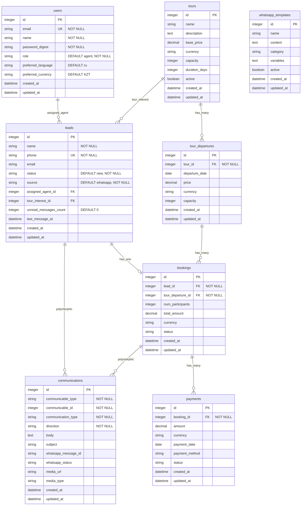

# Database ERD - Dreamland PRO

## Entity Relationship Diagram

## Relationship Details

### Users → Leads
- **Type:** One-to-Many (optional)
- **Foreign Key:** `leads.assigned_agent_id` → `users.id`
- **Description:** Users (agents) can be assigned multiple leads

### Leads → Tour (tour_interest)
- **Type:** Many-to-One (optional)
- **Foreign Key:** `leads.tour_interest_id` → `tours.id`
- **Description:** Leads can express interest in a specific tour

### Leads → Bookings
- **Type:** One-to-One
- **Foreign Key:** `bookings.lead_id` → `leads.id`
- **Description:** A lead can be converted to one booking

### Tours → Tour Departures
- **Type:** One-to-Many
- **Foreign Key:** `tour_departures.tour_id` → `tours.id`
- **Description:** Tours have multiple departure dates

### Tour Departures → Bookings
- **Type:** One-to-Many
- **Foreign Key:** `bookings.tour_departure_id` → `tour_departures.id`
- **Description:** Each departure can have multiple bookings

### Bookings → Payments
- **Type:** One-to-Many
- **Foreign Key:** `payments.booking_id` → `bookings.id`
- **Description:** Bookings can have multiple payment installments

### Communications (Polymorphic)
- **Type:** Polymorphic Many-to-One
- **Foreign Keys:** `communicable_type` + `communicable_id`
- **Targets:** Leads, Bookings
- **Description:** Communications can belong to either leads or bookings

### WhatsApp Templates
- **Type:** Standalone table (no foreign keys)
- **Description:** Message templates for WhatsApp communications

## Enum Values

### users.role
- `agent` (default)
- `manager`
- `admin`

### users.preferred_language
- `en`
- `ru` (default)

### users.preferred_currency / bookings.currency / payments.currency
- `USD`
- `KZT` (default for users)
- `EUR`
- `RUB`

### leads.status
- `new` (default)
- `contacted`
- `qualified`
- `quoted`
- `won`
- `lost`

### leads.source
- `whatsapp` (default)
- `website`
- `manual`
- `import`

### bookings.status
- `confirmed`
- `paid`
- `completed`
- `cancelled`

### communications.communication_type
- `whatsapp`
- `email`
- `phone`
- `sms`

### communications.direction
- `inbound`
- `outbound`

## Indexes

### Unique Indexes
- `users.email`
- `leads.phone`

### Foreign Key Indexes
- `leads.assigned_agent_id`
- `bookings.lead_id`
- `bookings.tour_departure_id`
- `payments.booking_id`
- `tour_departures.tour_id`
- `communications.communicable_type + communicable_id`

### Query Optimization Indexes
- `leads.status`
- `leads.source`
- `communications.communication_type`
- `communications.whatsapp_message_id`
